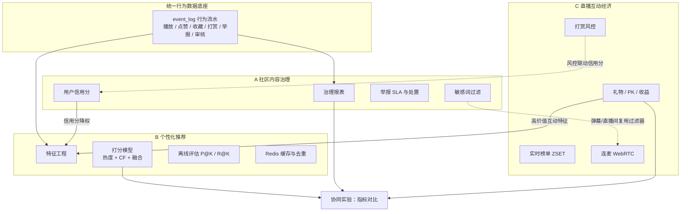

# NexusPlay 毕业设计方案

> **文档性质**：毕业设计的总体规划与实施路线，基于项目当前真实代码状态分析得出。
> **决策**：三个方向全选（社区内容治理 + 推荐系统 + 直播互动经济），时间约 **1 年**。
> **关联文档**：`README.md`（项目用法）· `UPGRADE_PLAN.md`（P0–P2 已实施记录 + P3 待办契约）
> **定位**：本文档回答「毕设怎么做」；`UPGRADE_PLAN.md` 回答「工程上改了什么」。

---

## 1. 决策摘要

| 项 | 结论 |
|----|------|
| 选题方向 | **ABC 全选**：A 社区内容治理 · B 推荐系统 · C 直播互动经济 |
| 可用时间 | 约 1 年（充裕，可做完整一套含评估与论文） |
| 论文主线 | 三个子系统 **数据互通、策略互喂**，而非功能并列堆砌 |
| 建议题目 | 《面向 UGC 视频社区的治理—分发—互动协同机制设计与实现》 |
| 创新点落点 | **协同实验**：证明治理信号与直播互动特征对推荐效果有可度量的增益 |
| 第一步 | **阶段 0 底座**：`event_log` 行为流水 + P3 补齐 + 种子数据 + 测试补缺 |

---

## 2. 现状盘点

### 2.1 已具备的能力（毕设的基本盘，不要推翻）

| 模块 | 现状 |
|------|------|
| 视频社区 | 投稿分片上传 → 审核 → 播放 → 弹幕 → 评论 → 点赞/收藏/关注，链路完整 |
| 播放体验 | 设置页与播放器共用同一份 defaults，弹幕/倍速/进度记忆/自动连播真实生效 |
| 社区功能 | 站内通知、播放历史、收藏夹、动态 Feed、举报（成立联动下架/软删） |
| 直播 | SRS 推拉流、礼物打赏、PK（含到期自动结束）、连麦信令、充值订单与账变、回放登记 |
| 管理后台 | 视频审核、分类、轮播、直播、礼物、打赏流水、钱包账变对账、举报处理、系统通知 |
| 工程化 | 双端 JWT、env 配置外置、媒体地址相对化、局域网联调代理、**15 个测试类 / 116 个用例** |
| 数据层 | `bankend/BiliPlus/sql/biliplus.sql`，**37 张表** |

### 2.2 毕设视角的硬伤

这些不是「功能不够」，而是**答辩时会被直接问倒**的地方：

| 问题 | 代码实况 | 答辩风险 |
|------|---------|---------|
| **推荐是假的** | `VideoMapper.xml` 中 `order by rand()`，纯随机，无任何打分 | 「你的推荐算法是什么」一句话被打穿 |
| **没有评估闭环** | 无指标埋点、无看板、无实验对比、无操作日志 | 「怎么证明你的系统更好」无法回答 |
| **Redis 用途单薄** | 仅 `PeopleUserServiceImpl` / `ValidateCodeServiceImpl` 等存图片与邮箱验证码 | 技术选型显得凑数 |
| **搜索是 LIKE** | 用户搜索 `LIKE '%kw%'`，视频搜索同样是标题模糊匹配 | 一问性能就露馅 |
| **P3 未实现** | 无数据看板、无用户管理/封禁页面、无操作日志 | 「运营能力」缺最后一环 |
| **单测有缺口** | `NotificationServiceImpl` 与稿件编辑（`updateMyVideo` 等）无独立测试类 | 测试完整性被质疑 |
| **未做端到端验证** | 本轮仅验证编译/单测/构建，未起 MySQL+Redis+SRS 跑真实链路 | 演示环境有翻车风险 |

更根本的问题：**「仿 B 站」是毕设重灾区**。评委见过几十个同款。需要一个说得出口的命题——不是功能多，而是**解决了什么问题、用什么方法、效果如何衡量**。

---

## 3. 总体设计：三方向协同叙事

三个方向若并列，论文没有研究问题。正确做法是让它们**相互喂养**：



**三条必须在论文里写死的链路**

| 链路 | 含义 | 落地方式 |
|------|------|----------|
| 治理 → 推荐 | 违规内容不应被分发 | 信用分、违规标记进入推荐降权特征 |
| 直播 → 推荐 | 打赏/长时观看是高价值信号 | 直播互动事件进入特征工程 |
| 治理 → 直播 | 直播间同样是 UGC，同样要管 | 直播举报接入举报体系、弹幕复用敏感词、打赏风控联动信用分 |

**创新点落点**：实验③「引入直播互动特征后推荐指标的变化」——它证明三者不是并列功能，而是存在**可度量的协同效应**。

---

## 4. 一年期路线图

| 阶段 | 时间 | 主题 | 核心交付 |
|------|------|------|----------|
| **阶段 0** | 第 1 个月 | 底座与度量 | **`event_log` 表与埋点 ✅ 已完成**；P3 三项、种子数据、测试补缺待做 |
| **阶段 1** | 第 2–4 个月 | 社区内容治理 | 敏感词、信用分、处置时限、举报 SLA、治理报表 |
| **阶段 2** | 第 5–7 个月 | 推荐系统 | 特征工程、算法递进、离线评估、线上缓存与去重 |
| **阶段 3** | 第 8–10 个月 | 直播互动经济 | 实时榜单、收益报表、打赏风控、连麦媒体流、直播间治理 |
| **阶段 4** | 第 11–12 个月 | 协同实验与论文 | 三个对比实验、论文撰写、答辩 PPT、Docker Compose 演示环境 |

**依赖关系**：阶段 0 是其余全部阶段的前提（没有行为流水就没有特征，也没有报表）；
阶段 1 与阶段 2 可部分并行，但推荐需要治理的信用分字段，故治理应先落地；
阶段 3 的打赏风控依赖阶段 1 的信用分；
阶段 4 依赖 1/2/3 全部完成。

> 具体起止日期请按你的开题时间顺延，表中「第 N 个月」为相对月份。

---

## 5. 阶段 0：底座与度量（第 1 个月）

**这一阶段不做任何「新方向」，但决定论文第 6 章有没有东西可写。**

### 5.1 补齐 P3 三项

| 功能 | 参考 `UPGRADE_PLAN.md` §8 | 说明 | 状态 |
|------|---------------------------|------|------|
| 数据看板 | §8.1 | `/admin/stats/overview`、`/trend`；KPI 卡片 + 趋势曲线 | ✅ |
| 操作日志 | §8.3 | `admin_operation_log` 表 + 关键操作埋点 + 只读列表页 | ✅ |
| 用户管理 | §8.2 | 封禁/解封、角色调整（`AdminMemberController`） | ✅ |

### 5.2 建立 `event_log` 行为流水表（**整个毕设的支点**）✅ 已落地

当前系统里播放量、点赞数只有聚合值（`video.view_count`、`like_count`），**没有明细流水**——推荐没法算，治理报表也没算不出趋势，协同实验更无从对比。

**实际落地的表结构**（已并入 `bankend/BiliPlus/sql/biliplus.sql`）：

```sql
CREATE TABLE `event_log` (
  `id`          BIGINT PRIMARY KEY AUTO_INCREMENT,
  `user_id`     BIGINT NULL COMMENT '未登录为 NULL',
  `event_type`  VARCHAR(32) NOT NULL,
  `target_type` VARCHAR(32) NULL,
  `target_id`   BIGINT NULL,
  `duration_sec` INT NULL,
  `extra`       VARCHAR(500) NULL COMMENT 'JSON 文本扩展',
  `source`      VARCHAR(16) NULL COMMENT 'web|admin|system',
  `create_time` DATETIME NOT NULL DEFAULT CURRENT_TIMESTAMP,
  KEY `idx_user_time` (`user_id`, `create_time`),
  KEY `idx_type_target` (`event_type`, `target_type`, `target_id`),
  KEY `idx_time` (`create_time`)
) ENGINE=InnoDB DEFAULT CHARSET=utf8mb4 COMMENT='统一行为流水';
```

> `extra` 用 `VARCHAR(500)` 存 JSON 文本，而非 MySQL `JSON` 类型：避免 MyBatis 类型处理器开销，
> 且便于按前缀检索。语义与原计划一致。

**已完成的埋点**（`EventLogService.record()`，写失败只打日志不影响主业务）：

| 服务 | 事件 |
|------|------|
| `VideoServiceImpl.getVideo` / `share` | `video_view` / `video_share` |
| `InteractionServiceImpl` | `video_like` / `video_unlike` / `video_favorite` / `video_unfavorite` / `follow` / `unfollow` |
| `CommentServiceImpl.saveComment` | `comment` |
| `DanmakuServiceImpl.saveDanmaku` | `danmaku` |
| `GiftServiceImpl.sendGift` | `gift_send`（extra 含礼物 ID 与金额） |
| `LiveRoomServiceImpl.enterRoom` | `live_enter` |
| `ReportServiceImpl.submit` | `report` |
| `AdminVideoServiceImpl` | `audit_pass` / `audit_reject` / `audit_offline` |
| `UserPenaltyServiceImpl.penalize` | `user_ban` |

**事件类型枚举**集中在 `constant/EventType.java`，阶段 2 的特征工程直接复用。

### 5.3 Redis 用途升级

从「只存验证码」扩展为毕设真正用得上的三类：

| 用途 | 结构 | 服务于 |
|------|------|--------|
| 计数器 | `INCR` / `HINCRBY`：播放、点赞、举报待处理数 | 看板、热榜 |
| 排行榜 | ZSET：礼物贡献榜、PK 榜、主播收入榜 | 阶段 3 |
| 缓存 | String + TTL：用户推荐列表、分类视频列表 | 阶段 2 推荐上线 |

### 5.4 种子数据脚本

没有量级，推荐评估与治理统计都无意义。目标规模：

| 实体 | 数量级 |
|------|--------|
| 用户 | 500+ |
| 视频 | 2000+（分布在多个分类） |
| 互动流水（`event_log`） | 10 万级 |
| 直播场次 / 礼物记录 | 数百 / 数千 |
| 举报 | 数百（含已处理与待处理） |

写成幂等的 SQL 或 Java 种子器，放在 `bankend/BiliPlus/sql/seed/` 或独立的 `DataSeedRunner`（`@Profile("seed")`）。

### 5.5 测试补缺

| 缺口 | 说明 |
|------|------|
| `NotificationServiceImplTest` | 分页、未读计数、单条已读、全部已读（触发路径已由 Comment/AdminVideo 测试间接覆盖） |
| `PeopleUserServiceImpl` 稿件管理测试 | `updateMyVideo` 鉴权与状态机、`deleteMyVideo` 软删、`resubmitMyVideo` 校验 |

同时把 `UPGRADE_PLAN.md` §12.2 的手工联调清单真正跑一遍（需要 MySQL/Redis/SRS）。

### 5.6 阶段 0 验收

- [ ] `event_log` 表建好，上述 7 处埋点全部落库
- [ ] 管理端看板能显示真实数字（与库中 count 口径一致）
- [ ] 操作日志可查，关键操作有记录
- [ ] 用户管理可封禁/解封，封禁后 C 端登录失败
- [ ] 种子数据脚本可重复执行
- [ ] 单测缺口补齐，`mvn test` 全绿
- [ ] §12.2 联调清单走完，无阻塞问题

---

## 6. 阶段 1：社区内容治理（第 2–4 个月）

> **状态：实施中。** 后端（数据模型 / 服务 / 接口 / 发布链路埋点 / 单测）已完成；
> 管理端页面进行中。指标中的「违规曝光率变化」依赖阶段 0 的 `event_log`，暂未接入。

### 6.1 功能清单

| 功能 | 实现要点 | 状态 |
|------|----------|------|
| 敏感词过滤 | `sensitive_word` 表（词、级别：拦截/转人工/仅标记）；投稿标题与简介、评论、弹幕、动态发布前命中即处置 | ✅ |
| 用户信用分 | `user_credit` 表；初始 100，举报成立 −10、敏感词 −5、审核驳回 −3、投稿通过 +2；低于 60 禁言 7 天、低于 30 禁言 30 天 | ✅ |
| 处置动作扩展 | `user_penalty` 表；mute/ban + 时限（null=永久），定时任务到期自动解封；封禁同步 `user.status=0` 使登录失效 | ✅ |
| 禁言生效 | 被禁言用户无法发评论、弹幕、动态 | ✅ |
| 举报 SLA | 待处理数、超时数（>24h）、平均处理时长、处理人工作量 | ✅ |
| 治理报表 | 违规类型分布、处理时效趋势、Top 违规用户、误伤率、处置复发率 | ✅ 接口就绪 |
| 误伤复核 | `sensitive_hit_log` 记录每次命中，管理端可标「确认违规 / 误伤」 | ✅ 接口就绪 |

### 6.2 数据模型（已落地）

```sql
sensitive_word(id, word UNIQUE, level, status, create_time)
sensitive_hit_log(id, word_id, word, level, user_id, target_type, target_id,
                  content, action, review_status, review_admin_id, review_time, create_time)
user_credit(user_id PK, score, violation_count, last_violation_time, update_time)
user_penalty(id, user_id, action, reason, start_time, end_time, admin_id, status, create_time)
```

**发布链路埋点**：`PeopleUserServiceImpl`（投稿/编辑）、`CommentServiceImpl`（评论）、
`DanmakuServiceImpl`（弹幕）、`DynamicServiceImpl`（动态）。
**信用分挂钩**：`AdminVideoServiceImpl`（通过 +2 / 驳回 −3）、`ReportServiceImpl`（举报成立 −10）。

### 6.3 评估指标（论文第 6 章的图）

| 指标 | 含义 | 数据来源 | 可算 |
|------|------|----------|------|
| 违规内容平均处理时长 | 从举报到处置完成 | `report.create_time` / `handle_time` | ✅ |
| 举报重复率 | 同一目标被多次举报的比例 | `report` 分组 | ✅ |
| 误伤率 | 敏感词拦截后被人工判为误伤的比例 | `sensitive_hit_log.review_status` | ✅ |
| 处置后复发率 | 被处置用户之后再产生新处置的比例 | `user_penalty` 自关联 | ✅ |
| 违规曝光率变化 | 治理介入前后违规视频的曝光占比 | `event_log.video_view` ∩ 违规视频集合 | ✅ |

**违规曝光率的口径**（已实现，接口 `/admin/governance/violation-exposure?days=N`）：

- 违规视频集合 = 举报成立的视频 ∪ 命中敏感词的视频 ∪ 已下架/驳回的视频
- 违规曝光率 = 窗口内 `video_view` 中，`target_id` 命中该集合的占比
- 返回汇总（总曝光 / 违规曝光 / 占比 / 违规视频数）与**按天趋势**，后者即「治理介入前后对比曲线」的数据源
- 分母为 0 时返回 `null` 而非 0，避免图表误读

---

## 7. 阶段 2：推荐系统（第 5–7 个月）

### 7.1 功能清单

| 功能 | 实现要点 |
|------|----------|
| 特征工程 | 从 `event_log` 聚合：播放完成率、点赞/收藏比、分类偏好向量、关注关系、**信用分**、**直播互动强度** |
| 算法递进 | ① 热度基线 → ② ItemCF / UserCF → ③ 加权融合（热度 + 协同 + 分类 + 治理降权） |
| 冷启动 | 新视频走分类热度 + 编辑精选；新用户走全站热度 + 注册兴趣区 |
| 离线评估 | 训练/测试集划分，输出 Precision@K、Recall@K、覆盖率、多样性 |
| 线上化 | Redis 缓存用户推荐列表（TTL 5min）、已看去重、同作者降权、多样性约束 |

### 7.2 算法递进（每一步都要有对比数据）

| 层级 | 算法 | 可解释性 | 用于答辩的说法 |
|------|------|---------|---------------|
| L0（现状） | `ORDER BY RAND()` | 无 | 反面基线 |
| L1 | 热度：播放 + 点赞×3 + 评论×5 + 收藏×4，带时间衰减 | 高 | 「无个性化基线」 |
| L2 | ItemCF：基于共现矩阵的物品相似度 | 中 | 「协同过滤」 |
| L3 | 融合：w1·热度 + w2·CF + w3·分类偏好 + w4·关注 + 治理降权 | 中 | **本文方法** |

治理降权规则（体现协同）：`score *= creditFactor(author)`，作者信用分低于阈值时分数被压低。

### 7.3 评估方案

- 数据：`event_log` 按时间切分，前 80% 训练、后 20% 测试
- 指标：Precision@10 / Recall@10 / 覆盖率（被推荐到的视频占比）/ 基尼系数（多样性）
- **必须产出的对比表**：L0 vs L1 vs L2 vs L3
- 附：接口耗时（千级数据下 < 300ms）

---

## 8. 阶段 3：直播互动经济（第 8–10 个月）

### 8.1 功能清单

| 功能 | 实现要点 |
|------|----------|
| 实时榜单 | Redis ZSET：礼物贡献榜、PK 榜、主播收入榜；替代 SQL 排序 |
| 连麦媒体流 | 补齐 WebRTC 推拉流（当前 `LiveMicServiceImpl` 只做信令 + `rtcAvailable` 降级） |
| 收益报表 | 主播收益明细、日/周/月汇总、提现申请模拟 |
| 打赏风控 | 单次/单日限额、短时高频异常检测、与信用分联动 |
| 直播间治理 | 直播举报接入现有举报体系、弹幕复用敏感词过滤器 |

### 8.2 评估指标

| 指标 | 说明 |
|------|------|
| 礼物流水分布 | 基尼系数，验证是否被少数大额打赏垄断 |
| 风控拦截准确率 | 拦截中真正异常的比例（人工抽检） |
| 榜单查询耗时 | Redis ZSET vs SQL `ORDER BY` 的对比，体现 Redis 的价值 |
| 连麦成功率 | RTC 开启时双方媒体流建立成功的比例 |

---

## 9. 阶段 4：协同实验与论文（第 11–12 个月）

### 9.1 三个实验

| 实验 | 对比对象 | 产出 | 论文作用 |
|------|---------|------|----------|
| ① 治理效果 | 治理介入前 vs 后 | 违规曝光率下降曲线、处理时长缩短 | 证明方向 A 有效 |
| ② 推荐效果 | rand() vs 热度 vs CF vs 融合 | P@K / R@K / 覆盖率对比表 | 证明方向 B 有效 |
| ③ **协同效果** | 无直播特征 vs 有直播特征 | 推荐指标变化 | **证明 A/B/C 协同，本文创新点** |

### 9.2 论文章节与代码映射

| 章节 | 使用的项目材料 |
|------|---------------|
| 1 绪论 | UGC 平台治理与分发的痛点；仿 B 站项目缺乏可度量目标的问题 |
| 2 相关技术 | Spring Boot 3.2 / MyBatis / Redis / JWT / SRS / Vue 3 / DPlayer |
| 3 需求分析 | §10 的角色×场景表 + 用例图 + 非功能需求 |
| 4 系统设计 | 三层架构图、37 表 ER 图（挑核心 10 张）、治理流程图、推荐算法流程图、直播信令时序图 |
| 5 系统实现 | 选 3 个有深度的模块走读：**账变事务一致性**（`GiftServiceImpl`）、**举报→下架联动**（`ReportServiceImpl`）、**推荐打分融合**（阶段 2 新建） |
| 6 系统测试 | 单测统计 + 接口测试 + §9.1 三个实验 |
| 7 总结与展望 | 已做/未做；后续可接 ES 搜索、真实支付网关、多人连麦 |

### 9.3 答辩准备

| 事项 | 说明 |
|------|------|
| 演示环境 | **Docker Compose 一键启动** MySQL + Redis + SRS + 后端 + 前台 + 管理端，避免答辩现场手动起 5 个服务翻车 |
| 演示脚本 | 固定一条路径：注册 → 投稿 → 审核 → 播放 → 举报 → 处置 → 看板指标变化 → 推荐列表对比 → 直播送礼与榜单 |
| 数据备份 | 演示前导出一份「干净且有代表性」的数据库快照 |
| 查重 | 论文初稿留出至少 2 周做查重与降重 |

---

## 10. 用户与场景需求

论文「需求分析」章可直接使用的骨架。

### 10.1 用户角色

| 角色 | 职责 | 关键能力 |
|------|------|----------|
| 游客 | 未登录浏览 | 看公开视频、搜索、看直播广场与回放；互动时被引导登录 |
| 普通用户 | 内容消费者 | 评论/点赞/收藏/关注、播放历史与续播、收藏夹、动态流、私信、举报 |
| UP 主 | 创作者 | 分片投稿、稿件管理（编辑/重提/删除）、查看审核结果与驳回原因、个人空间数据 |
| 主播 / 观众 | 直播参与者 | 开播推流、观看与弹幕、送礼与充值账变、发起 PK、连麦申请、看回放 |
| 管理员 / 运营 | 平台治理者 | 视频审核、举报处理、用户封禁、账变对账、系统通知、**数据看板、操作日志、治理报表** |

### 10.2 核心场景用例

| 角色 | 场景 | 现有支撑 | 阶段 0–4 补充 |
|------|------|----------|---------------|
| 普通用户 | 看视频并调整播放偏好 | `/setting/player` + `DanmakuPlayer` 消费设置 | — |
| 普通用户 | 跨设备续播 | `/pp/play-history` | — |
| 普通用户 | 发现感兴趣的内容 | `/pp/videos/recommend` | **阶段 2：真实推荐算法 + 评估** |
| 普通用户 | 举报违规内容 | `/pp/reports` + 管理端处理 | 阶段 1：SLA 与处置时限 |
| UP 主 | 投稿并追踪审核结果 | 分片上传 + 稿件管理 + 通知 | — |
| UP 主 | 稿件被驳回后修改重提 | `/pp/people/my/videos/{id}/resubmit` | — |
| 主播 | 直播收礼物并查看收益 | 开播 + 礼物 + `host_income` + 账变明细 | 阶段 3：收益报表与提现模拟 |
| 观众 | 充值并看到每笔扣款流水 | `/pp/live/wallet/recharge/orders` + 事务 | — |
| 管理员 | 处理举报并下架违规视频 | `/admin/reports` + 联动下架 | 阶段 1：SLA 统计、误伤申诉 |
| 管理员 | 对账资金流水 | `/admin/live/wallet/transactions` | 阶段 3：汇总报表 |
| 管理员 | 掌握平台整体运行情况 | — | **阶段 0：数据看板** |
| 管理员 | 追溯谁做了什么操作 | — | **阶段 0：操作日志** |
| 管理员 | 管理违规用户 | 部分（直播封禁） | **阶段 0：用户管理页面** + 阶段 1：信用分与禁言时限 |

### 10.3 非功能需求

| 类别 | 要求 | 验证方式 |
|------|------|---------|
| 安全 | 未登录 401、越权 403、密钥不入库（`.env` 已被 gitignore） | 接口测试 + 代码审查 |
| 一致性 | 扣款与账变同事务；余额不足时**不产生任何流水** | `WalletServiceImplTest` / `GiftServiceImplTest` |
| 性能 | 列表接口 < 300ms（千级数据）；榜单查询 Redis 化后 < 50ms | 压测 / 计时日志 |
| 可用性 | RTC/录制未配置时**明确降级**而非崩溃 | `LiveMicServiceImpl` / `LiveReplayServiceImpl` 分支 |
| 可追溯 | 管理端关键操作留痕 | `admin_operation_log` |
| 可度量 | 业务行为可统计、可对比 | `event_log` 行为流水 |

---

## 11. 风险与对策

| 风险 | 对策 |
|------|------|
| **贪多嚼不烂**：三块都做浅 | 每阶段以「评估指标」为验收标准；**做不出指标就说明没做透**，宁可砍功能也要保住指标 |
| **`event_log` 不做，后面全白搭** | 阶段 0 必须建好并开始积累数据；后续所有评估都吃这张表 |
| **推荐冷启动数据不足** | 用种子数据脚本造 10 万级流水；真实环境不足时在论文中说明实验数据的构造方式 |
| **演示环境翻车** | Docker Compose 一键启动 + 演示前快照 + 固定演示脚本，答辩前至少演练 3 次 |
| **论文写成「功能说明书」** | 第 5 章只深挖 3 个模块，第 6 章必须有对比实验数据；避免流水账 |
| **方向之间接口漂移** | 以 `UPGRADE_PLAN.md` 为契约源，实现偏差回写附录 C；本文档记录毕设层面的决策 |
| **时间失控** | 每阶段结束写一次「阶段验收」，未通过不进入下一阶段 |

---

## 12. 下一步

按顺序执行：

1. ~~建 `event_log` 表 + 在 7 处服务埋点~~ ✅ **已完成**（见 §5.2，含违规曝光率指标）
2. ~~补齐 P3 三项（看板 / 操作日志 / 用户管理）~~ ✅ **已完成**
3. Redis 升级（计数器 / 排行榜 / 缓存）
4. 种子数据脚本
5. 补 `NotificationServiceImplTest` 与稿件管理测试
6. 起真实中间件跑完 `UPGRADE_PLAN.md` §12.2 联调清单
7. 阶段 0 验收通过后，再进入下一阶段

> 阶段 1（内容治理）已提前落地：敏感词 / 信用分 / 处置时限 / 举报 SLA / 治理报表均已实现，
> 五个评估指标全部可算。阶段 0 的剩余项（P3、种子数据、Redis 升级）可按需穿插推进。

> 阶段 0 完成后，建议在 `UPGRADE_PLAN.md` 的实施状态表中同步 P3 的进展，并把本文档的路线图作为后续排期依据。

---

**文档结束。** 阶段推进时请更新本文档对应章节的验收勾选状态。


