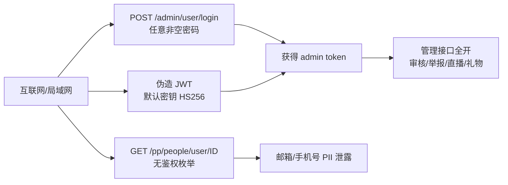

# NexusPlay（BiliPlus）黑盒安全评估报告

- **评估日期**：2026-09-28
- **评估方式**：黑盒（只启动服务并对外探测，未阅读业务源码）
- **范围**：后端 API `:8081`、用户前台 `:5173`、管理后台 `:5174`、本地暴露端口与配置
- **风险等级**：Critical / High / Medium / Low / Info

---

## 执行摘要

本次测试在**不读业务源码**的前提下完成服务启动与黑盒渗透。共发现 **2 个 Critical**、**4 个 High**、若干 Medium/Low 问题。其中两个 Critical 可直接导致管理后台完全沦陷：

1. **管理端密码校验失效**：账号 `admin` 使用任意非空密码均可登录成功。
2. **JWT 默认密钥可伪造**：用配置中的 `biliPlusAdminSecretKey2024` 可离线伪造管理员 token，直接调用管理接口。

PoC 已用伪造 token 成功创建分类 `forge-test`（id=20），并读取视频审核列表、举报、直播房间、礼物流水等管理数据。

---

## Critical

### C-1 管理端登录密码校验绕过

| 项 | 内容 |
|----|------|
| 接口 | `POST /admin/user/login` |
| 影响 | 任意人可登录管理后台 |
| 复现 | `{"account":"admin","password":"任意非空字符串"}` 均返回 `code:1` 与 JWT |

**证据**：以下密码全部登录成功（同一账号）：

`admin` / `123456` / `password` / `completely-random-xyz-999` / `a` / `中文密码` / `{{7*7}}` / `admin'--` 等。

空密码会失败；错误账号（`nope`/`admin2`）会失败。说明**存在账号查询，但密码比对逻辑失效或被短路**。

**建议**：立即修复密码校验（BCrypt/Argon2 比对），强制重置 admin 密码，增加登录失败锁定与审计。

---

### C-2 JWT 默认密钥可伪造管理员身份

| 项 | 内容 |
|----|------|
| 密钥 | `JWT_ADMIN_SECRET=biliPlusAdminSecretKey2024`（`application.yml` 默认值，`.env` 未覆盖为强随机串） |
| 算法 | HS256 |
| Claims | `{"adminId":1,"exp":...}` |
| 影响 | 离线伪造 token → 完整管理权限 |

**证据**：使用上述密钥伪造 token 后，下列接口均返回 200 业务数据：

- `GET /admin/category/list`
- `GET /admin/videos/page`（18 条视频）
- `GET /admin/banners/list`
- `GET /admin/gifts`
- `GET /admin/reports`（含举报人 ID、处理人 ID）
- `GET /admin/live/rooms`
- `GET /admin/live/gift/records`
- `POST /admin/category`（**写入成功**，创建了 id=20 的 `forge-test`）

**建议**：

1. 生产环境使用 ≥32 字节 CSPRNG 密钥，禁止提交默认值。
2. 启动时拒绝已知弱密钥。
3. 增加 token 失效/黑名单（Redis）与管理端二次验证。

---

## High

### H-1 未鉴权用户 PII 泄露（IDOR）

| 项 | 内容 |
|----|------|
| 接口 | `GET /pp/people/user/{userId}` |
| 鉴权 | **无需登录** |
| 泄露字段 | `username`, `email`, `phone`, `nickname`, `avatar`, 粉丝/关注数 |

**证据**：对 `id=1..15` 枚举即可拿到多个用户邮箱与手机号（含真实 QQ 邮箱）。搜索接口 `/pp/people/search` 会脱敏 `email/phone` 为 null，但详情接口未脱敏——属于**不一致的鉴权/脱敏**。

**建议**：

- 详情接口默认脱敏邮箱/手机号，仅本人或好友可见。
- 对枚举增加限速与统一错误（不要用“用户不存在”区分存在性）。

---

### H-2 登录 / 管理登录无频率限制（可暴力破解）

- `POST /pp/people/login`：连续 20+ 次失败仍正常响应，无锁定/验证码/延迟。
- `POST /admin/user/login`：连续 15+ 次失败无限制。

**建议**：按账号+IP 限速、失败锁定、关键操作二次验证；管理端强制复杂密码与 2FA。

---

### H-3 敏感配置与凭证明文落盘

| 位置 | 内容 |
|------|------|
| `bankend/BiliPlus/.env` | QQ 邮箱账号 + SMTP 授权码、DB root/`123456`、JWT 密钥 |
| `application.yml` | 默认 `DB_PASSWORD:123456`、默认 JWT 密钥 |

**建议**：SMTP 授权码立即重置；密钥/密码仅用环境变量或密钥管理服务；`.env` 确保永不进仓库（当前已 ignore，但仍在磁盘明文）。

---

### H-4 MySQL root 弱口令且监听 0.0.0.0

- 端口 `3306` 对所有网卡监听
- `root` / `123456` 可直接登录（本机验证成功）
- JDBC `useSSL=false`

**建议**：绑定 `127.0.0.1`，禁用远程 root，改强口令/证书，启用 TLS。

---

## Medium

### M-1 异常信息与堆栈类信息泄露

多处把 Java 内部实现返回给客户端：

| 场景 | 泄露内容 |
|------|----------|
| `GET /pp/videos/page`（缺参） | `com.biliplus.pojo.dto.userdto.VideoPageQueryDTO.getPage()` NPE |
| `POST /pp/people/email`（验证码逻辑） | `ImageCaptcha is null` / `equalsIgnoreCase` NPE |
| JSON 解析失败 | Jackson `JSON parse error: Unexpected character...` |
| 未匹配路径 | 被 `GlobalExceptionHandler` 统一成 HTTP 500「服务器内部错误」（404 被伪装） |

**建议**：业务异常返回友好文案 + 错误码；5xx 只记日志；404 返回真正的 404；`server.error.include-message=never`。

---

### M-2 Spring DevTools / LiveReload 对外暴露

- `35729` 监听 `0.0.0.0`，`GET /livereload.js` 可访问（33KB）
- 启动日志：`Devtools property defaults active!`

生产/局域网环境可能导致热更新与额外攻击面。

**建议**：生产禁止 devtools；`spring.devtools.add-properties=false`；防火墙限制。

---

### M-3 服务与前端监听所有网卡

| 端口 | 服务 | 监听 |
|------|------|------|
| 8081 | API | 0.0.0.0 |
| 5173/5174 | Vite | 0.0.0.0 + 局域网 IP |
| 35729 | LiveReload | 0.0.0.0 |
| 3306 | MySQL | 0.0.0.0 |

**建议**：开发也尽量 `127.0.0.1`；生产仅反代暴露。

---

### M-4 缺少安全响应头

对 `/pp/categories` 等响应仅有 `Vary/Transfer-Encoding/Content-Type/Date`，缺少：

`X-Content-Type-Options`、`X-Frame-Options` / `frame-ancestors`、`Referrer-Policy`、`Content-Security-Policy`、`Strict-Transport-Security`。

CORS 对未知 Origin 返回 403（较好），且 `Access-Control-Allow-Credentials: true` 仅白名单源。

---

### M-5 业务功能缺陷（可用性/一致性）

1. `/pp/videos/page` 参数名不一致：`page+pageSize` 可用，`pageNum/pageSize` 触发 NPE 信息泄露。
2. 未知路由统一 500，难以区分 404/500。
3. `/pp/notifications/unread-count` 未登录也返回 200（`data:0`），语义上应要求登录。

---

## Low / Info

| ID | 问题 |
|----|------|
| L-1 | 用户 JWT（people 端）用常见 claim 形状未能伪造成功（可能 claim 名/校验不同），但默认密钥仍写在配置里，一旦泄露同样可伪造 |
| L-2 | `alg=none` 未被接受（较好） |
| L-3 | 登录接口对 SQL 注入 payload 仅返回“用户名或密码错误”（无报错注入迹象）；标题搜索引号未触发 SQL 错误，疑似参数化查询 |
| L-4 | 上传接口未鉴权时返回 401（较好） |
| L-5 | `.git.bak` 暴露远程仓库 `https://gitee.com/bycgou/biliplus.git` |
| L-6 | 启动日志打印数据源 URL/用户名 |
| L-7 | 管理 token 存 `localStorage`（XSS 可窃取）；建议 httpOnly Cookie 或更短时效+刷新 |

---

## 攻击链示意

---

## 修复优先级

1. **立即**：修复 admin 密码校验（C-1）；更换 JWT 密钥并强制失效旧 token（C-2）；重置 SMTP 授权码与 DB 密码（H-3/H-4）。
2. **本周**：用户详情脱敏与 IDOR（H-1）；登录限速（H-2）；异常信息收敛（M-1）；关闭 DevTools（M-2）。
3. **持续**：安全头、监听面收窄、审计日志、2FA、依赖与配置扫描。

---

## 测试环境状态

| 组件 | 状态 |
|------|------|
| MySQL | 运行中（3306） |
| Redis | 运行中（6379，仅 127.0.0.1） |
| 后端 API | 已启动 :8081 |
| 用户前台 | 已启动 :5173 |
| 管理后台 | 已启动 :5174 |

**副作用说明**：验证写权限时创建了分类 `forge-test`（id=20），可在管理后台删除。

---

## 方法边界

按要求**未阅读业务源码**。接口发现来自：运行时前端模块图、响应指纹、错误信息与代理配置。未做破坏性操作（未删库、未改用户密码、未攻击第三方）。
