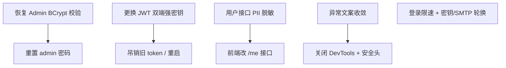

# NexusPlay 安全修复方案（代码级）

> 基于黑盒评估 `SECURITY_ASSESSMENT.md` 的源码定位与修复建议。  
> 优先级：P0 立即 → P1 本周 → P2 持续。

---

## P0-1 管理端密码校验被注释（C-1）

**文件**：`bankend/BiliPlus/src/main/java/com/biliplus/service/Impl/AdminUserServieImpl.java`

**根因**：BCrypt 比对整段被注释，查到账号后直接放行。

```java
// BCrypt 密码校验
//        if (!passwordEncoder.matches(adminPassword, adminUser.getPassword())) {
//            log.warn("管理员登录失败：密码错误, account={}", adminAccount);
//            return null;
//        }
```

**修复**：

1. 恢复密码比对，并兼容历史明文（仅迁移期）或强制重置哈希。
2. 登录失败统一文案，避免枚举（当前已统一「账号或密码错误」，可保留）。
3. 修复后立即重置 `admin` 密码并失效旧 JWT。

```java
@Override
public AdminUser login(AdminUserLoginDTO adminUserLoginDTO) {
    String adminAccount = adminUserLoginDTO.getAccount();
    String adminPassword = adminUserLoginDTO.getPassword();

    if (adminAccount == null || adminAccount.trim().isEmpty()
            || adminPassword == null || adminPassword.isEmpty()) {
        log.warn("管理员登录失败：账号或密码为空");
        return null;
    }

    AdminUser adminUser = adminUserMapper.login(adminAccount.trim());
    if (adminUser == null || adminUser.getAccount() == null) {
        log.warn("管理员登录失败：账号不存在 account={}", adminAccount);
        return null;
    }

    String stored = adminUser.getPassword();
    if (stored == null || stored.isEmpty()) {
        log.warn("管理员登录失败：密码未初始化 account={}", adminAccount);
        return null;
    }

    boolean ok = false;
    if (stored.startsWith("$2a$") || stored.startsWith("$2b$") || stored.startsWith("$2y$")) {
        ok = passwordEncoder.matches(adminPassword, stored);
    } else {
        // 兼容：仅开发库明文；匹配后强制升级为 BCrypt
        ok = constantTimeEquals(adminPassword, stored);
        if (ok) {
            adminUser.setPassword(passwordEncoder.encode(adminPassword));
            // TODO: 写回数据库 updatePassword(id, encoded)
            log.warn("管理员 {} 使用了明文密码，已标记为需强制重置", adminAccount);
        }
    }

    if (!ok) {
        log.warn("管理员登录失败：密码错误 account={}", adminAccount);
        return null;
    }

    log.info("管理员登录成功 id={}", adminUser.getId());
    return adminUser;
}

private static boolean constantTimeEquals(String a, String b) {
    if (a == null || b == null) return false;
    return java.security.MessageDigest.isEqual(
            a.getBytes(java.nio.charset.StandardCharsets.UTF_8),
            b.getBytes(java.nio.charset.StandardCharsets.UTF_8));
}
```

**配套**：

- 生产禁止明文分支；启动时扫描 admin 密码是否 `$2` 前缀，否则拒绝启动或告警。
- 登录接口增加失败计数（见 P1-2）。

---

## P0-2 JWT 默认弱密钥可伪造（C-2）

**文件**：

- `application.yml`：`biliplus.jwt.admin-secret-key` / `biliplus.peoplejwt.people-secret-key`
- `JwtUtil.validateSecretKey`：仅校验长度 ≥ 16
- 签发：`AdminUserController.login` claims=`{adminId}`

**根因**：

1. yml 默认值就是可猜测密钥：`biliPlusAdminSecretKey2024`
2. 密钥未绑定环境/用途，拿到密钥即可伪造 `{"adminId":1}`

**修复**：

### 1) 配置与启动校验

```yaml
# application.yml —— 去掉弱默认，改为必填
biliplus:
  jwt:
    admin-secret-key: ${JWT_ADMIN_SECRET}
    admin-ttl: ${JWT_ADMIN_TTL:7200000}
  peoplejwt:
    people-secret-key: ${JWT_PEOPLE_SECRET}
    people-ttl: ${JWT_PEOPLE_TTL:604800000}
```

```java
// JwtUtil.java —— 加强校验
private static final int MIN_SECRET_LENGTH = 32;
private static final java.util.Set<String> FORBIDDEN = java.util.Set.of(
    "biliPlusAdminSecretKey2024",
    "biliPlusPeopleSecretKey2024",
    "change-me-admin",
    "change-me-people"
);

private static void validateSecretKey(String secretKey) {
    if (secretKey == null || secretKey.trim().length() < MIN_SECRET_LENGTH) {
        throw new IllegalArgumentException("JWT secret key too short. Min 32 chars.");
    }
    if (FORBIDDEN.contains(secretKey.trim())
            || secretKey.toLowerCase().contains("change-me")
            || secretKey.toLowerCase().contains("secretkey2024")) {
        throw new IllegalArgumentException("JWT secret key is a known weak default. Refusing to start.");
    }
}
```

### 2) Token 更难伪造（建议）

- 增加 `typ` claim（`admin` / `people`），解析时强制匹配，防止 admin/people 密钥混用。
- 管理端 token TTL 缩短（如 2h）+ 刷新令牌；关键操作二次验证。
- 密钥轮换：生成后写入环境变量，**吊销全部旧 token**（改密钥即失效）。

```bash
# 生成强密钥示例
node -e "console.log(require('crypto').randomBytes(48).toString('base64url'))"
```

### 3) 操作清单

1. 生成新 `JWT_ADMIN_SECRET` / `JWT_PEOPLE_SECRET`
2. 更新 `.env` / 部署环境（不要写回仓库）
3. 重启服务（旧 token 全部失效）
4. 重置 admin 密码

---

## P0-3 用户 PII 未脱敏（H-1）

**文件**：

- `PeopleUserController.getUserById` → `PeopleUserServiceImpl.getUserById`
- DTO：`UserDTO` 含 `email` / `phone`

**根因**：`BeanUtils.copyProperties(user, userDTO)` 把库实体整包拷到对外 DTO；而 `searchUsers` 已手工脱敏，两处不一致。

**修复**（推荐拆公开/私密 VO）：

```java
// 新增公开资料 VO，不含 email/phone
@Data
public class UserPublicVO {
    private Long id;
    private String username;
    private String avatar;
    private String nickname;
    private String signature;
    private Long fansCount;
    private Long followingCount;
}

// UserDTO 仅用于「本人资料」接口
```

`PeopleUserServiceImpl`：

```java
@Override
public UserPublicVO getUserPublicById(Long userId) {
    User user = peopleUserMapper.getUserById(userId);
    if (user == null) return null;
    UserPublicVO vo = new UserPublicVO();
    vo.setId(user.getId());
    vo.setUsername(user.getUsername());
    vo.setAvatar(user.getAvatar());
    vo.setNickname(user.getNickname());
    vo.setSignature(user.getSignature());
    // fans/following ...
    return vo;
}
```

**例外**：本人查自己（`UserContext.getCurrentUserId().equals(userId)`）时返回完整 `UserDTO`。

**接口**：`GET /pp/people/user/{userId}` 改为返回 `UserPublicVO`；新增 `GET /pp/people/me` 返回含联系方式的资料。

前端若依赖 email/phone，改为走 `/pp/people/me` 或 `updateUserInfo` 回显。

---

## P1-1 异常信息泄露（M-1）

**文件**：`GlobalExceptionHandler`、`PeopleUserController`（captcha/email）

**问题**：

1. `handleRuntimeException` 把 `e.getMessage()` 原样返回 → NPE 会带上 `com.biliplus.pojo...` 类名
2. `catch` 后 `Result.error(e.getMessage())` 同样泄露
3. 404 被 `Exception` 兜底成 500

**修复**：

```java
@ExceptionHandler(RuntimeException.class)
public ResponseEntity<Result<?>> handleRuntimeException(RuntimeException e) {
    // 仅业务约定异常透出文案
    if (e instanceof com.biliplus.exception.BusinessException be) {
        return ResponseEntity.badRequest().body(Result.error(be.getMessage()));
    }
    log.error("业务异常", e);
    return ResponseEntity.badRequest().body(Result.error("请求处理失败，请稍后再试"));
}

@ExceptionHandler(org.springframework.web.servlet.resource.NoResourceFoundException.class)
public ResponseEntity<Result<?>> handleNotFound(Exception e) {
    return ResponseEntity.status(404).body(Result.error("资源不存在"));
}

@ExceptionHandler(org.springframework.http.converter.HttpMessageNotReadableException.class)
public ResponseEntity<Result<?>> handleJsonError(Exception e) {
    log.warn("JSON 解析失败: {}", e.getMessage());
    return ResponseEntity.badRequest().body(Result.error("请求参数格式错误"));
}
```

Controller 内不要 `return Result.error(e.getMessage())`，统一抛 `BusinessException` 或返回固定文案。

`application.yml`：

```yaml
server:
  error:
    include-message: never
    include-binding-errors: never
    include-stacktrace: never
```

---

## P1-2 登录无限速（H-2）

**建议**（Redis 已具备）：

| 维度 | 限制 |
|------|------|
| 同账号失败 | 5 次 / 15 分钟 → 锁 15 分钟 |
| 同 IP 失败 | 20 次 / 15 分钟 |
| 邮箱验证码 | 1 次 / 60 秒，5 次 / 天 / 邮箱 |
| 图片验证码 | 校验后一次性删除（已有）+ 失败计数 |

实现骨架：

```java
String key = "login:fail:" + account;
Long n = stringRedisTemplate.opsForValue().increment(key);
if (n == 1) stringRedisTemplate.expire(key, Duration.ofMinutes(15));
if (n != null && n >= 5) {
    throw new BusinessException("尝试次数过多，请稍后再试");
}
```

管理端登录额外要求密码复杂度；建议开启 2FA（可后置）。

---

## P1-3 配置与密钥治理（H-3 / H-4）

| 项 | 修复 |
|----|------|
| `.env` 含 QQ SMTP 授权码 | **立即在 QQ 邮箱重置授权码**，换新写入部署环境 |
| `DB_PASSWORD:123456` | 改强口令；MySQL 仅绑定 127.0.0.1 |
| yml 默认 JWT | 见 P0-2，改为 `${JWT_*}` 无弱默认 |
| DevTools | 生产排除依赖或 `spring.devtools.add-properties=false`；`35729` 不对外 |
| 启动日志 | 去掉打印数据源 URL/用户名 |

```yaml
# 生产 profile
spring:
  devtools:
    restart:
      enabled: false
    livereload:
      enabled: false
```

pom：`spring-boot-devtools` 加 `<optional>true</optional>` 并 `spring-boot-maven-plugin` exclude，或 `provided` 仅开发。

---

## P1-4 安全响应头

在 `WebMvcConfiguration` 或 Filter 统一加：

```java
@Component
public class SecurityHeaderFilter extends OncePerRequestFilter {
    @Override
    protected void doFilterInternal(HttpServletRequest req, HttpServletResponse res, FilterChain chain)
            throws ServletException, IOException {
        res.setHeader("X-Content-Type-Options", "nosniff");
        res.setHeader("X-Frame-Options", "DENY");
        res.setHeader("Referrer-Policy", "strict-origin-when-cross-origin");
        res.setHeader("Permissions-Policy", "camera=(), microphone=(), geolocation=()");
        // 生产再加 HSTS / CSP
        chain.doFilter(req, res);
    }
}
```

---

## P2 其他

| ID | 建议 |
|----|------|
| L-1 | people JWT 增加 `typ=people`，与 admin 密钥隔离（已能伪造 admin，people 同样要换密钥） |
| L-5 | 删除或 ignore `.git.bak`，远程地址勿暴露 |
| L-6 | 日志脱敏：邮箱打码、禁止输出验证码明文（`sendEmailCode` 当前有 log 密码验证码） |
| L-7 | 管理端 token 考虑 httpOnly Cookie + CSRF，或缩短 TTL |
| M-5 | `VideoPageQueryDTO` 字段名与前端 `page/pageSize` 对齐，避免 NPE |
| 业务 | 测试写入的分类 `forge-test`（id=20）删除 |

---

## 建议落地顺序



| 顺序 | 动作 | 预估 |
|------|------|------|
| 1 | 恢复密码校验 + 重置 admin 密码 | 0.5h |
| 2 | 换 JWT 密钥并重启 | 0.5h |
| 3 | PII 脱敏（后端 VO） | 1–2h |
| 4 | 异常收敛 + 安全头 | 1h |
| 5 | 登录限速（Redis） | 2h |
| 6 | DevTools/绑定/SMTP/DB 口令 | 1h |

---

## 回归验证清单

- [ ] `POST /admin/user/login` 错误密码 → 失败；正确密码 → 成功  
- [ ] 用旧弱密钥伪造 admin JWT → 401  
- [ ] `GET /pp/people/user/1` 无 token → **不含** email/phone  
- [ ] 本人 `GET /pp/people/me` → 含自己的联系方式  
- [ ] `GET /pp/videos/page` 缺参 → 固定文案，无 Java 类名  
- [ ] 连续 5 次错误登录 → 限速提示  
- [ ] 响应头含 `X-Content-Type-Options` / `X-Frame-Options`  
- [ ] 未暴露 35729 / 明文 SMTP / 弱 DB 密码  

---

## 附：关键代码位置

| 问题 | 位置 |
|------|------|
| 密码校验注释 | `AdminUserServieImpl.java` ~L43-47 |
| 用户登录 BCrypt（正确参考） | `PeopleUserServiceImpl.userlogin` ~L95 |
| JWT 签发 admin | `AdminUserController.login` claims `adminId` |
| JWT 签发 user | `PeopleUserController.login` claims `userId` |
| PII 透传 | `PeopleUserServiceImpl.getUserById` `BeanUtils.copyProperties` |
| 搜索已脱敏 | `searchUsers` 手工 set 字段 |
| 异常泄露 | `GlobalExceptionHandler.handleRuntimeException` |
| 默认密钥 | `application.yml` L73/L77 |
| 公开 GET 白名单 | `JwtTokenPeopleInterceptor.PRIVATE_GET_PREFIXES` |
